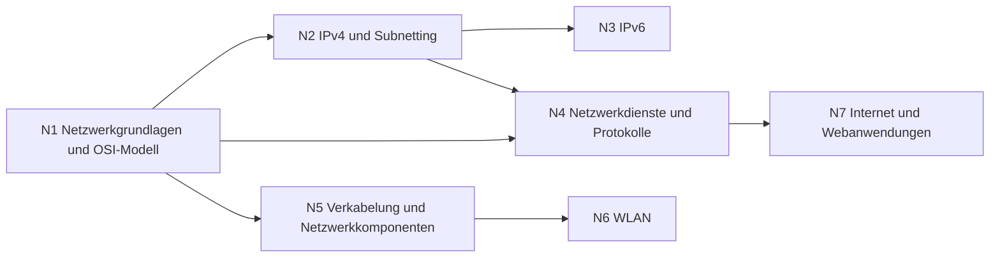

# Übersicht Netzwerk

Vom OSI-Modell über IP-Adressen bis zu Verkabelung und WLAN – alles, was ein Arbeitsplatz braucht, um ins Netz zu kommen.

## Lernpfad

*Pfeile: empfohlene Reihenfolge – was links steht, hilft beim Verständnis rechts.*

## Module
| | Modul | Inhalt |
|---|---|---|
| [[N1 Netzwerkgrundlagen und OSI-Modell\|N1]] | Netzwerkgrundlagen und OSI-Modell | Schichtenmodell, TCP/UDP, Fehlersuche |
| [[N2 IPv4 und Subnetting\|N2]] | IPv4 und Subnetting | Adressen, Subnetze, VLSM |
| [[N3 IPv6\|N3]] | IPv6 | Aufbau, Kürzen, Adresstypen |
| [[N4 Netzwerkdienste und Protokolle\|N4]] | Netzwerkdienste und Protokolle | ARP, DHCP, DNS, NAT, Ports, E-Mail |
| [[N5 Verkabelung und Netzwerkkomponenten\|N5]] | Verkabelung und Netzwerkkomponenten | Kabel, dB-Rechnung, Switch, VLAN, PoE |
| [[N6 WLAN\|N6]] | WLAN | Standards, Kanäle, Sicherheit |
| [[N7 Internet und Webanwendungen\|N7]] | Internet und Webanwendungen | URL, HTTP, statisch/dynamisch, HTML/CSS/JS, CMS, Impressum |

## Üben
- **Aufgaben im IHK-Stil:** [[Aufgaben Netzwerk]]
- **Karteikarten:** [[Karten Netzwerk]]
- **Rechentrainer und Quiz:** [[Trainer]] · [[Quiz]]

← [[Start]]
