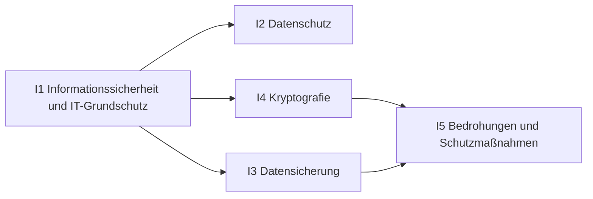

# Übersicht IT-Sicherheit

Schutzziele und Grundschutz, Datenschutz nach DSGVO, Datensicherung, Kryptografie und Abwehr von Angriffen.

## Lernpfad

*Pfeile: empfohlene Reihenfolge – was links steht, hilft beim Verständnis rechts.*

## Module
| | Modul | Inhalt |
|---|---|---|
| [[I1 Informationssicherheit und IT-Grundschutz\|I1]] | Informationssicherheit und IT-Grundschutz | Schutzziele, Risiko, Schutzbedarf, BSI |
| [[I2 Datenschutz\|I2]] | Datenschutz | DSGVO, Rechte, Pflichten, TOM |
| [[I3 Datensicherung\|I3]] | Datensicherung | Sicherungsarten, 3-2-1, RPO/RTO |
| [[I4 Kryptografie\|I4]] | Kryptografie | Symmetrisch, asymmetrisch, Hash, Signatur, PKI |
| [[I5 Bedrohungen und Schutzmaßnahmen\|I5]] | Bedrohungen und Schutzmaßnahmen | Malware, Angriffe, MFA, Firewall, Notfall |

## Üben
- **Aufgaben im IHK-Stil:** [[Aufgaben IT-Sicherheit]]
- **Karteikarten:** [[Karten IT-Sicherheit]]
- **Rechentrainer und Quiz:** [[Trainer]] · [[Quiz]]

← [[Start]]
