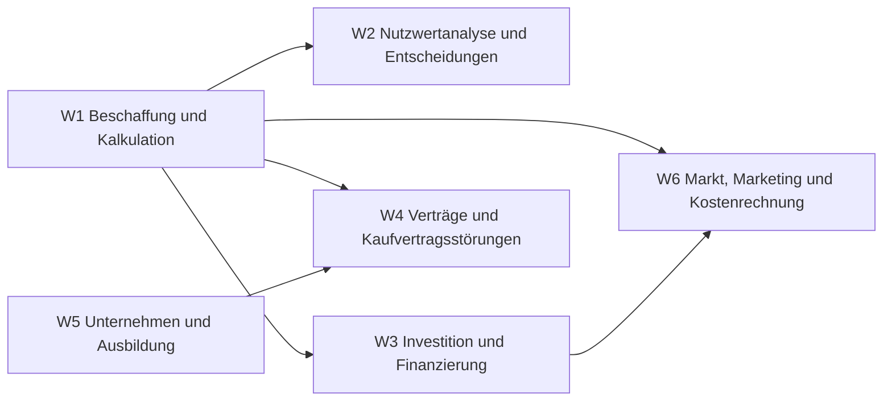

# Übersicht Wirtschaft

Beschaffen und kalkulieren, Entscheidungen begründen, finanzieren, Verträge und Mängel, Unternehmen und Ausbildung.

## Lernpfad

*Pfeile: empfohlene Reihenfolge – was links steht, hilft beim Verständnis rechts.*

## Module
| | Modul | Inhalt |
|---|---|---|
| [[W1 Beschaffung und Kalkulation\|W1]] | Beschaffung und Kalkulation | Bezugskalkulation, Umsatzsteuer, Verkaufspreis |
| [[W2 Nutzwertanalyse und Entscheidungen\|W2]] | Nutzwertanalyse und Entscheidungen | Nutzwertanalyse, Paarvergleich |
| [[W3 Investition und Finanzierung\|W3]] | Investition und Finanzierung | Kauf/Leasing/Miete, Darlehen, AfA |
| [[W4 Verträge und Kaufvertragsstörungen\|W4]] | Verträge und Kaufvertragsstörungen | Kaufvertrag, Mängel, Verzug, Gewährleistung |
| [[W5 Unternehmen und Ausbildung\|W5]] | Unternehmen und Ausbildung | Rechtsformen, Organisation, Ausbildung |
| [[W6 Markt, Marketing und Kostenrechnung\|W6]] | Markt, Marketing und Kostenrechnung | Markt, Marketing, Deckungsbeitrag, Stundensatz, Kennzahlen |

## Üben
- **Aufgaben im IHK-Stil:** [[Aufgaben Wirtschaft]]
- **Karteikarten:** [[Karten Wirtschaft]]
- **Rechentrainer und Quiz:** [[Trainer]] · [[Quiz]]

← [[Start]]
