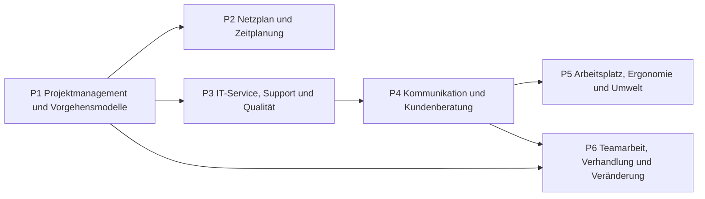

# Übersicht Projekt und Service

Projekte planen und abschließen, Zeitplanung mit Netzplan, IT-Service und Qualität, Kommunikation und ergonomische Arbeitsplätze.

## Lernpfad

*Pfeile: empfohlene Reihenfolge – was links steht, hilft beim Verständnis rechts.*

## Module
| | Modul | Inhalt |
|---|---|---|
| [[P1 Projektmanagement und Vorgehensmodelle\|P1]] | Projektmanagement und Vorgehensmodelle | Projektmerkmale, Lasten-/Pflichtenheft, Scrum |
| [[P2 Netzplan und Zeitplanung\|P2]] | Netzplan und Zeitplanung | Vorgangsknoten, Puffer, kritischer Pfad |
| [[P3 IT-Service, Support und Qualität\|P3]] | IT-Service, Support und Qualität | Incident, Support-Level, SLA, PDCA |
| [[P4 Kommunikation und Kundenberatung\|P4]] | Kommunikation und Kundenberatung | Vier-Seiten-Modell, Fragetechniken, Beschwerden |
| [[P5 Arbeitsplatz, Ergonomie und Umwelt\|P5]] | Arbeitsplatz, Ergonomie und Umwelt | Bildschirmarbeitsplatz, Barrierefreiheit, Green IT |
| [[P6 Teamarbeit, Verhandlung und Veränderung\|P6]] | Teamarbeit, Verhandlung und Veränderung | Tuckman, Kick-off, Harvard-Konzept, Change Management |

## Üben
- **Aufgaben im IHK-Stil:** [[Aufgaben Projekt und Service]]
- **Karteikarten:** [[Karten Projekt und Service]]
- **Rechentrainer und Quiz:** [[Trainer]] · [[Quiz]]

← [[Start]]
