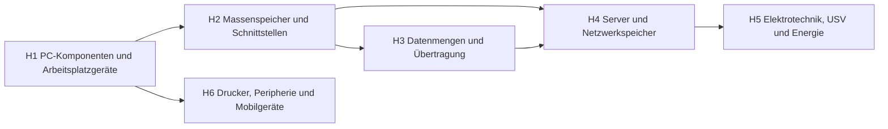

# Übersicht Hardware

Komponenten auswählen und begründen, Datenmengen berechnen, Server absichern und mit Strom versorgen.

## Lernpfad

*Pfeile: empfohlene Reihenfolge – was links steht, hilft beim Verständnis rechts.*

## Module
| | Modul | Inhalt |
|---|---|---|
| [[H1 PC-Komponenten und Arbeitsplatzgeräte\|H1]] | PC-Komponenten und Arbeitsplatzgeräte | CPU, RAM, Mainboard, Monitor, Geräteklassen |
| [[H2 Massenspeicher und Schnittstellen\|H2]] | Massenspeicher und Schnittstellen | SSD/HDD, USB, Thunderbolt, Bildschirmanschlüsse |
| [[H3 Datenmengen und Übertragung\|H3]] | Datenmengen und Übertragung | Bit/Byte, Präfixe, Übertragungsdauer, Medien |
| [[H4 Server und Netzwerkspeicher\|H4]] | Server und Netzwerkspeicher | Serverhardware, DAS/NAS/SAN |
| [[H5 Elektrotechnik, USV und Energie\|H5]] | Elektrotechnik, USV und Energie | Ohm, Leistung, USV, Energiekosten |
| [[H6 Drucker, Peripherie und Mobilgeräte\|H6]] | Drucker, Peripherie und Mobilgeräte | Druckkosten, Scanner, Notebook/Tablet, MDM |

## Üben
- **Aufgaben im IHK-Stil:** [[Aufgaben Hardware]]
- **Karteikarten:** [[Karten Hardware]]
- **Rechentrainer und Quiz:** [[Trainer]] · [[Quiz]]

← [[Start]]
