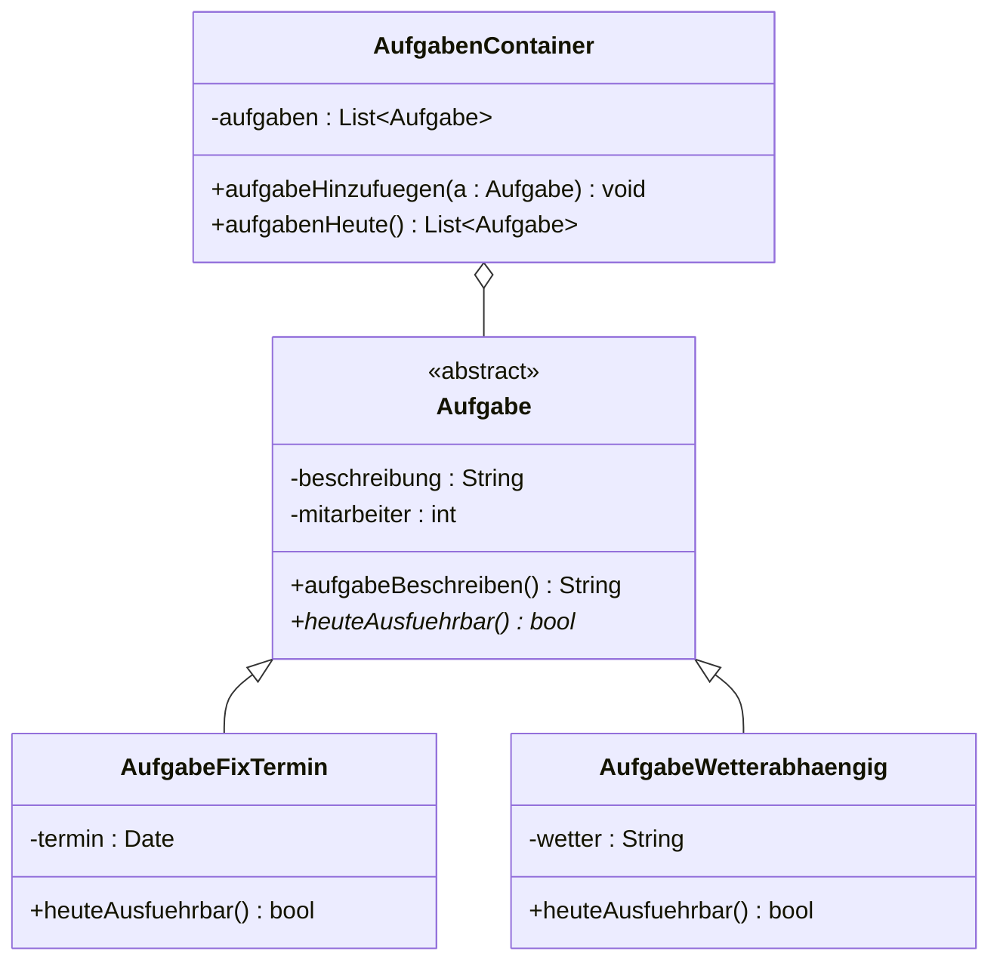
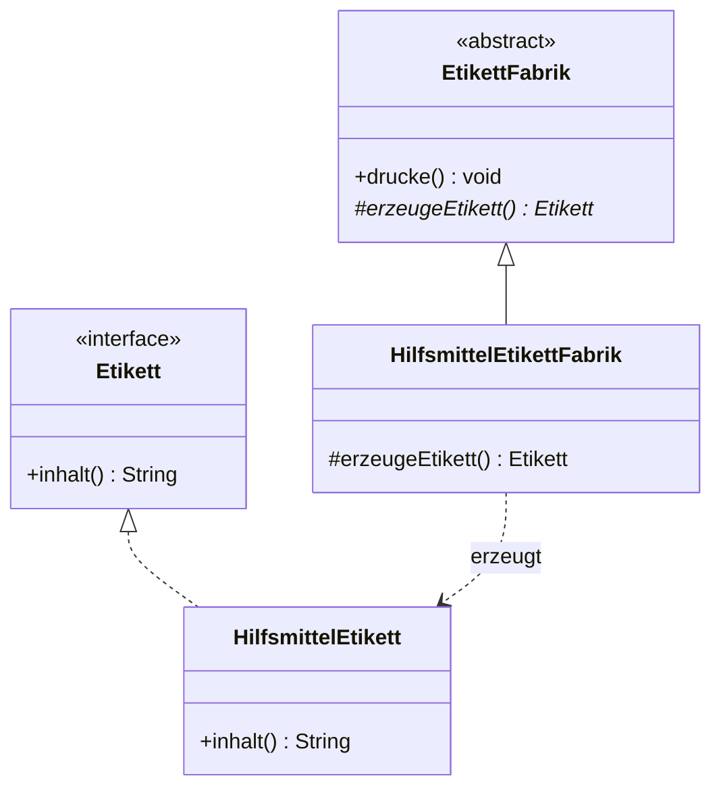

# FIAE-4 · Objektorientierter Entwurf und Entwurfsmuster

> [!abstract] Überblick
> **Bereich:** [[Übersicht FIAE Planen eines Softwareproduktes]]
> **Prüfung:** beide FIAE-Teile
> **Dauer:** ca. 150 min · **Prüfungsrelevanz:** ★★★ – Entwurfsmuster, Klassendiagramme mit Vererbung sowie Aggregation, Komposition und Multiplizität sicher anwenden.
> **Grundlagen aus AP1:** [[S8 UML und Softwareentwurf]] · [[S2 Programmierung – Grundlagen]]

## Lernziele
- [ ] Ich kann ein Klassendiagramm mit Attributen, Methoden, Sichtbarkeiten, Datentypen und Beziehungen lesen und zeichnen.
- [ ] Ich kann Assoziation, Aggregation, Komposition, Vererbung und Realisierung mit Multiplizitäten unterscheiden.
- [ ] Ich kann Kapselung, Vererbung, Polymorphie, abstrakte Klassen und Interfaces erklären.
- [ ] Ich kenne Kategorien von Entwurfsmustern und kann Singleton, Factory Method, Observer, Facade, Strategy, Adapter und MVC beschreiben und anwenden.

## So wird das geprüft
> [!info] Typische AP2-Aufgabentypen
> - **Klassendiagramm zeichnen** mit Oberklasse und Unterklassen, Containerklasse und Beziehungen.
> - **Aggregation vs. Komposition erklären**, **Multiplizitäten 1..* und *** deuten.
> - **Entwurfsmuster:** Vorteile, Kategorien mit Beispiel, **Observer** anwenden, **Factory Method** erläutern, Einschränkung nennen und Klassenmodell ergänzen, weiteres Muster beschreiben.
> - **Abstrakte Klasse vs. Interface**, **dynamische Bindung/Polymorphie**, **Klasse User mit Methoden**.

---

## 1. Klassendiagramm

```
┌──────────────────────────────┐
│          Versammlung         │   ← Klassenname
├──────────────────────────────┤
│ - titel : String             │   ← Attribute: Sichtbarkeit Name : Typ
│ - teilnehmer : List<Aktionaer>│
├──────────────────────────────┤
│ + einladen(a : List<Aktionaer>) : void │ ← Methoden
│ - istAngemeldet(a : Aktionaer) : Boolean│
└──────────────────────────────┘
```
**Sichtbarkeiten:** `+` public · `-` private · `#` protected · `~` package. *Kursiv* = abstrakt, unterstrichen = statisch.

| Beziehung | Symbol | Bedeutung | Beispiel |
|---|---|---|---|
| **Assoziation** | Linie (evtl. Pfeil für Navigierbarkeit) | Objekte kennen sich | Kunde – Bestellung |
| **Aggregation** | Linie mit **leerer Raute** ◇ am Ganzen | „hat“ – Teil kann **ohne** das Ganze existieren | Personalverwaltung ◇– Fahrer |
| **Komposition** | Linie mit **gefüllter Raute** ◆ am Ganzen | Teil ist **existenzabhängig** vom Ganzen | Rechnung ◆– Rechnungsposition |
| **Vererbung** (Generalisierung) | Pfeil mit **leerem Dreieck** zur Oberklasse | „ist ein“ | AufgabeFixTermin ▷ Aufgabe |
| **Realisierung** | **gestrichelter** Pfeil mit leerem Dreieck | Klasse implementiert Interface | AvgDisplay ⇢ Observer |
| **Abhängigkeit** | gestrichelter Pfeil | nutzt kurzzeitig | |

**Multiplizitäten:** `1` genau eins · `0..1` keins oder eins · `*` bzw. `0..*` beliebig viele (auch keine) · `1..*` **mindestens eins**.
> `1..*` bei Personal → Fahrer: es gibt wenigstens einen Fahrer. `*` bei Fahrer → Fahrzeug: ein neuer Fahrer darf noch **kein** Fahrzeug fahren.



---

## 2. OOP-Prinzipien

- **Kapselung (Geheimnisprinzip):** Attribute sind `private`; Zugriff nur über Methoden (Getter/Setter), die Werte prüfen können.
- **Vererbung:** Unterklasse übernimmt Attribute und Methoden der Oberklasse und erweitert oder **überschreibt** sie. Neue Aufgabenarten → neue Unterklasse, der Container bleibt unverändert (**offen für Erweiterung, geschlossen für Änderung**).
- **Polymorphie:** Eine Variable vom Typ der Oberklasse kann Objekte verschiedener Unterklassen enthalten; beim Aufruf einer überschriebenen Methode entscheidet **erst zur Laufzeit** der tatsächliche Objekttyp, welche Implementierung läuft (**dynamische/späte Bindung**).
- **Abstraktion:** unwichtige Details weglassen, gemeinsame Oberklassen/Interfaces bilden.

| | **abstrakte Klasse** | **Interface** | normale Klasse |
|---|---|---|---|
| Objekte erzeugen | **nein** | nein | ja |
| Attribute | ja | nur Konstanten | ja |
| Methoden | abstrakte **und** implementierte | Signaturen (in Java/C# auch Default-Methoden) | nur implementierte |
| Vererbung | eine Oberklasse (Java/C#) | eine Klasse kann **mehrere** Interfaces implementieren | |
| Zweck | gemeinsamer Code + erzwungene Methoden | **Vertrag/Rolle** ohne Implementierung | |

---

## 3. Entwurfsmuster

**Entwurfsmuster** (Design Patterns, „Gang of Four“) sind **bewährte Lösungsschablonen für wiederkehrende Entwurfsprobleme**. Vorteile: erprobt (spart Zeit und Fehler), verbessern Wartbarkeit und Erweiterbarkeit, **gemeinsames Vokabular** im Team.

| Kategorie | Zweck | Beispiele |
|---|---|---|
| **Erzeugungsmuster** | Objekterzeugung kapseln | **Singleton**, **Factory Method**, Abstract Factory, Builder |
| **Strukturmuster** | Klassen/Objekte zusammensetzen | **Facade**, **Adapter**, Decorator, Composite, Proxy |
| **Verhaltensmuster** | Zusammenarbeit und Verantwortung | **Observer**, **Strategy**, Command, State, Iterator |

| Muster | Idee | Einsatz |
|---|---|---|
| **Singleton** | Klasse hat **genau eine** Instanz mit globalem Zugriffspunkt (privater Konstruktor, statische `getInstance()`) | Konfiguration, Logger, Datenbankverbindung |
| **Factory Method** | Basisklasse definiert eine **Methode zur Objekterzeugung**; **Unterklassen überschreiben** sie und entscheiden, welches konkrete Objekt entsteht | Etiketten/Dokumente verschiedener Typen erzeugen |
| **Observer** | Subjekt hält eine Liste von Beobachtern; ändert sich sein Zustand, ruft es `notify()` → alle Beobachter werden per `update()` informiert | mehrere Anzeigen für denselben Messwert, Ereignisse, MVC |
| **Facade** | einfache Schnittstelle vor einem komplexen Subsystem | Bibliotheken kapseln |
| **Adapter** | passt eine inkompatible Schnittstelle an die erwartete an | Altsystem anbinden |
| **Strategy** | austauschbare Algorithmen hinter einer gemeinsamen Schnittstelle | Sortier- oder Preisberechnungsverfahren |
| **MVC** (Architekturmuster) | Model (Daten) – View (Anzeige) – Controller (Steuerung) getrennt | Web- und Desktop-Anwendungen |

**Factory Method – Einschränkung:** Die erzeugten Klassen müssen eine **gemeinsame Oberklasse oder ein gemeinsames Interface** haben, damit der Aufrufer sie einheitlich behandeln kann.



**Observer im Code (Pseudocode):**
```
Klasse Messwerte (Subjekt)
  - beobachter : List<Observer>
  + anmelden(o : Observer)   → beobachter.add(o)
  + setWert(w : Double)      → wert ← w ; benachrichtigen()
  - benachrichtigen()        → für jeden o in beobachter: o.update(wert)

Interface Observer
  + update(wert : Double)

Klasse DurchschnittsAnzeige implementiert Observer
  + update(wert : Double)    → Durchschnitt neu berechnen und anzeigen
```

---

> [!warning] Typische Fehler in Prüfungen
> - Rauten auf der **falschen Seite** – die Raute sitzt beim **Ganzen**.
> - Vererbungspfeil mit gefüllter Spitze oder in die falsche Richtung (er zeigt **zur Oberklasse**).
> - Singleton ohne privaten Konstruktor beschreiben.
> - Observer und Factory Method in die falsche Kategorie stecken (Observer = Verhalten, Factory = Erzeugung).
> - Polymorphie mit Überladen verwechseln – gemeint ist das **Überschreiben** mit Auswahl zur Laufzeit.

## Verwandte Themen
- [[FIAE-10 Objektorientierte Programmierung umsetzen]] – Klassen in Code
- [[FIAE-3 UML Aktivität, Sequenz und Zustand]] – dynamische Diagramme
- [[FIAE-5 Datenmodellierung und Normalisierung]] – vom Klassen- zum Datenmodell
- [[S8 UML und Softwareentwurf]] – Grundlagen aus AP1

## Zusammenfassung
- Klassendiagramm: Name / Attribute / Methoden, Sichtbarkeit + - # ~.
- Aggregation ◇ (unabhängig), Komposition ◆ (existenzabhängig), Vererbung ▷ (ist ein), Realisierung gestrichelt ▷.
- Multiplizität: 1, 0..1, *, 1..*.
- Kapselung, Vererbung, Polymorphie (dynamische Bindung zur Laufzeit), abstrakte Klasse vs. Interface.
- Muster: Erzeugung (Singleton, Factory Method), Struktur (Facade, Adapter), Verhalten (Observer, Strategy); MVC.

## Selbstcheck
```dataviewjs
await dv.view("AP2/99 System/views/quiz", { modul: "FIAE-4" })
```

**Weitere Aufgaben:** [[Aufgaben Planen eines Softwareproduktes#FIAE-4 Objektorientierter Entwurf und Entwurfsmuster]] · **Karteikarten:** [[Karten Planen eines Softwareproduktes]]

## Einschätzung
```dataviewjs
await dv.view("AP2/99 System/views/selbstcheck")
```

---
← [[FIAE-3 UML Aktivität, Sequenz und Zustand]] · Weiter: [[FIAE-5 Datenmodellierung und Normalisierung]] →
