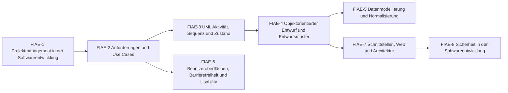

# Übersicht FIAE Planen eines Softwareproduktes

Vom Projektauftrag über Anforderungen, UML und Datenmodell bis zu Oberfläche, Schnittstellen und Sicherheit – alles, was vor und neben dem Programmieren geplant wird.

> [!info] Prüfung
> **Planen eines Softwareproduktes** – schriftlich, 90 Minuten, 4 Aufgaben, 10 % der Gesamtnote. Typische Aufgabentypen: Projektmanagement/Stakeholder · Modellierung (Use Case, ER, Maske) · Prozess/Sicherheit/Netz · Entwurfsmuster/Datenbank. [[AP2/FIAE/20 Aufgaben/Pruefungen/Uebersicht FIAE AP2|Zu den FIAE-Probeprüfungen]]

## Lernpfad

*Pfeile: empfohlene Reihenfolge – was links steht, hilft beim Verständnis rechts. Die Knoten sind anklickbar.*

## Module
| | Modul | Inhalt |
|---|---|---|
| [[FIAE-1 Projektmanagement in der Softwareentwicklung\|FIAE-1]] | Projektmanagement in der Softwareentwicklung | klassisch vs. agil, Scrum, Stakeholder, Umfeld/Machbarkeit, Risiken, Change Request, Netzplan, Abschluss |
| [[FIAE-2 Anforderungen und Use Cases\|FIAE-2]] | Anforderungen und Use Cases | Lasten-/Pflichtenheft, funktional/nichtfunktional, ISO 25010, Use-Case-Diagramm, User Stories, eRechnung |
| [[FIAE-3 UML Aktivität, Sequenz und Zustand\|FIAE-3]] | UML Aktivität, Sequenz und Zustand | Aktivitätsdiagramm mit Fork/Join, Sequenzdiagramm mit alt/opt/loop, Zustandsdiagramm |
| [[FIAE-4 Objektorientierter Entwurf und Entwurfsmuster\|FIAE-4]] | Objektorientierter Entwurf und Entwurfsmuster | Klassendiagramm, Beziehungen, Multiplizitäten, Polymorphie, abstrakt vs. Interface, Entwurfsmuster |
| [[FIAE-5 Datenmodellierung und Normalisierung\|FIAE-5]] | Datenmodellierung und Normalisierung | ER-Modell, Tabellenmodell, n:m, Anomalien, Normalformen, Datenqualität, NoSQL, Speicherbedarf |
| [[FIAE-6 Benutzeroberflächen, Barrierefreiheit und Usability\|FIAE-6]] | Benutzeroberflächen, Barrierefreiheit und Usability | Wireframe/Mockup/Prototyp, Eingabemasken, ISO 9241-110, Usability-Tests, WCAG/BFSG |
| [[FIAE-7 Schnittstellen, Web und Architektur\|FIAE-7]] | Schnittstellen, Web und Architektur | REST, CRUD, Request/Response, Statuscodes, JSON/XML/XSD, Architekturen, Compiler/Interpreter, Git, LoRa, Ethernet |
| [[FIAE-8 Sicherheit in der Softwareentwicklung\|FIAE-8]] | Sicherheit in der Softwareentwicklung | Schutzziele, sym./asym./hybrid, RSA, Hash + Salt, OWASP, Passwort-Reset, Datenschutzerklärung |

## Üben
- **Aufgaben im IHK-Stil:** [[Aufgaben Planen eines Softwareproduktes]]
- **Karteikarten:** [[Karten Planen eines Softwareproduktes]]
- **Rechentrainer und Quiz:** [[AP2 FIAE Trainer]] · [[AP2 FIAE Quiz]]
- **Probeprüfungen mit Timer:** [[AP2/FIAE/20 Aufgaben/Pruefungen/Uebersicht FIAE AP2|FIAE-Probeprüfungen]]

← [[AP2 FIAE Start]] · Weiter: [[Übersicht FIAE Algorithmen]] →

