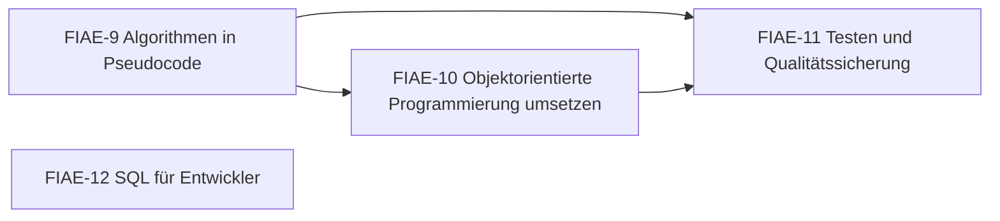

# Übersicht FIAE Algorithmen

Pseudocode schreiben, Klassen umsetzen, testen und SQL – der Prüfungsteil mit den meisten „Handschrift-Punkten“.

> [!info] Prüfung
> **Entwicklung und Umsetzung von Algorithmen** – schriftlich, 90 Minuten, 4 Aufgaben, 10 % der Gesamtnote. Typische Aufgabentypen: Methode in Pseudocode · UML/OOP oder Methoden · Testen/Datenmodell · SQL. [[AP2/FIAE/20 Aufgaben/Pruefungen/Uebersicht FIAE AP2|Zu den FIAE-Probeprüfungen]]

## Lernpfad

*Pfeile: empfohlene Reihenfolge – was links steht, hilft beim Verständnis rechts. Die Knoten sind anklickbar.*

## Module
| | Modul | Inhalt |
|---|---|---|
| [[FIAE-9 Algorithmen in Pseudocode\|FIAE-9]] | Algorithmen in Pseudocode | Pseudocode-Konventionen, Zählen/Filtern/Durchschnitt/Max, Zählarray, verschachtelte Suche, Sortieren, Suchen, Modulo |
| [[FIAE-10 Objektorientierte Programmierung umsetzen\|FIAE-10]] | Objektorientierte Programmierung umsetzen | Klasse → Code, Collections, Vererbung, Polymorphie, Exceptions, Datentypen |
| [[FIAE-11 Testen und Qualitätssicherung\|FIAE-11]] | Testen und Qualitätssicherung | Teststufen, White-/Black-Box, C0/C1/C2, Pfade, Äquivalenzklassen, Grenzwerte, Unit-Tests, F.I.R.S.T. |
| [[FIAE-12 SQL für Entwickler\|FIAE-12]] | SQL für Entwickler | SELECT mit JOIN/GROUP BY/HAVING, Unterabfragen, UNION, INSERT/UPDATE/DELETE, Archivierung, ALTER, GRANT |

> [!tip] Verwandte Planungsmodule
> Für Aufgabe 2 und 3 brauchst du oft auch [[FIAE-3 UML Aktivität, Sequenz und Zustand]], [[FIAE-4 Objektorientierter Entwurf und Entwurfsmuster]] und [[FIAE-5 Datenmodellierung und Normalisierung]].

## Üben
- **Aufgaben im IHK-Stil:** [[Aufgaben Algorithmen]]
- **Karteikarten:** [[Karten Algorithmen]]
- **Rechentrainer und Quiz:** [[AP2 FIAE Trainer]] · [[AP2 FIAE Quiz]]
- **Probeprüfungen mit Timer:** [[AP2/FIAE/20 Aufgaben/Pruefungen/Uebersicht FIAE AP2|FIAE-Probeprüfungen]]

← [[Übersicht FIAE Planen eines Softwareproduktes]] · [[AP2 FIAE Start]]

