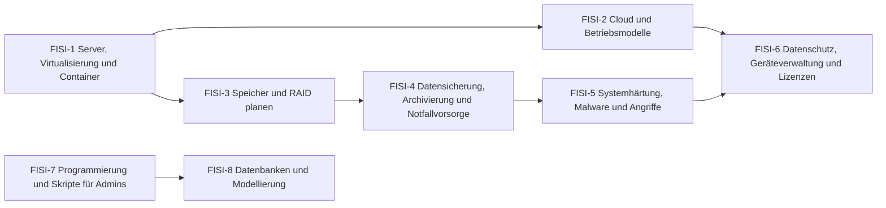

# Übersicht FISI Konzeption und Administration

Server und Cloud planen, Speicher berechnen, Daten sichern, Systeme härten, Datenschutz umsetzen sowie Programmlogik lesen, prüfen und korrigieren.

> [!info] Prüfung
> **Konzeption und Administration von IT-Systemen** – schriftlich, 90 Minuten, 4 Aufgaben, 10 % der Gesamtnote. Typische Themen: Cloud/Virtualisierung/Server · Sicherheit/Datenschutz oder Speicher · Programmlogik · Speicher/Backup. [[AP2/FISI/20 Aufgaben/Pruefungen/Uebersicht FISI AP2|Zu den FISI-Probeprüfungen]]

## Lernpfad

*Pfeile: empfohlene Reihenfolge – was links steht, hilft beim Verständnis rechts. Die Knoten sind anklickbar.*

## Module
| | Modul | Inhalt |
|---|---|---|
| [[FISI-1 Server, Virtualisierung und Container\|FISI-1]] | Server, Virtualisierung und Container | Serverauswahl, Netzteil, Energiekosten, Hypervisor Typ 1/2, Container, Cluster, Load Balancing |
| [[FISI-2 Cloud und Betriebsmodelle\|FISI-2]] | Cloud und Betriebsmodelle | IaaS/PaaS/SaaS, Public/Private/Hybrid, On-Premises vs. Cloud, Anbieterauswahl, Latenz |
| [[FISI-3 Speicher und RAID planen\|FISI-3]] | Speicher und RAID planen | GiB/TiB, Speicherbedarf, Plattenanzahl RAID 5/6/10, Hot Spare, NAS/SAN, Dedup, MTBF |
| [[FISI-4 Datensicherung, Archivierung und Notfallvorsorge\|FISI-4]] | Datensicherung, Archivierung und Notfallvorsorge | Backuparten mit Archivbit, Rücksicherung, GVS, 3-2-1, Archiv/WORM, RTO/RPO, USV-Typen |
| [[FISI-5 Systemhärtung, Malware und Angriffe\|FISI-5]] | Systemhärtung, Malware und Angriffe | Härtung, BIOS/UEFI, Least Privilege, Zero Trust, Malware, Phishing, Passwörter |
| [[FISI-6 Datenschutz, Geräteverwaltung und Lizenzen\|FISI-6]] | Datenschutz, Geräteverwaltung und Lizenzen | Schutzziele, TOM, Datenpanne, Anonymisierung, Datenträgervernichtung, MDM/BYOD, CAL, Patches |
| [[FISI-7 Programmierung und Skripte für Admins\|FISI-7]] | Programmierung und Skripte für Admins | Schreibtischtest, Fehler finden, Datentypen, Modulo, Testarten, Windows/Linux-Befehle |
| [[FISI-8 Datenbanken und Modellierung\|FISI-8]] | Datenbanken und Modellierung | SQL-Grundlagen, Datentypen, ER-Modell, NoSQL, Index/Locking, UML statisch/dynamisch |

## Üben
- **Aufgaben im IHK-Stil:** [[Aufgaben Konzeption und Administration]]
- **Karteikarten:** [[Karten Konzeption und Administration]]
- **Rechentrainer und Quiz:** [[AP2 FISI Trainer]] · [[AP2 FISI Quiz]]
- **Probeprüfungen mit Timer:** [[AP2/FISI/20 Aufgaben/Pruefungen/Uebersicht FISI AP2|FISI-Probeprüfungen]]

← [[AP2 FISI Start]] · Weiter: [[Übersicht FISI Netzwerke]] →

