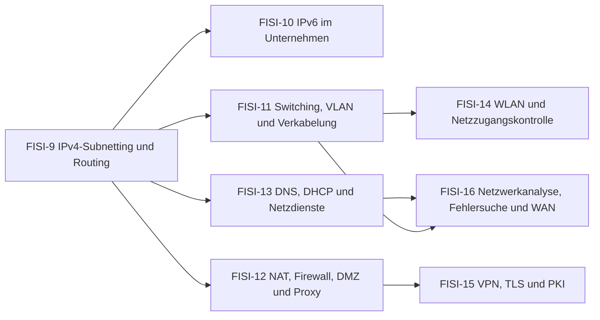

# Übersicht FISI Netzwerke

Netze planen (Subnetze, VLANs, Routing), absichern (Firewall, VPN, 802.1X) und Fehler finden (Mitschnitte, Befehlsausgaben) – der Kern der FISI-Ausbildung.

> [!info] Prüfung
> **Analyse und Entwicklung von Netzwerken** – schriftlich, 90 Minuten, 4 Aufgaben, 10 % der Gesamtnote. Typische Themen sind Subnetting/Routing, Firewall/NAT, WLAN/VLAN, Kryptografie/VPN und Netzwerkanalyse. [[AP2/FISI/20 Aufgaben/Pruefungen/Uebersicht FISI AP2|Zu den FISI-Probeprüfungen]]

## Lernpfad

*Pfeile: empfohlene Reihenfolge – was links steht, hilft beim Verständnis rechts. Die Knoten sind anklickbar.*

## Module
| | Modul | Inhalt |
|---|---|---|
| [[FISI-9 IPv4-Subnetting und Routing\|FISI-9]] | IPv4-Subnetting und Routing | Adresse analysieren, VLSM, private Bereiche, Routingtabelle, Default-Route, RIP/OSPF, FHRP |
| [[FISI-10 IPv6 im Unternehmen\|FISI-10]] | IPv6 im Unternehmen | Adresstypen, /56 → /64, SLAAC/DHCPv6, Dual Stack, IPv6-Probleme |
| [[FISI-11 Switching, VLAN und Verkabelung\|FISI-11]] | Switching, VLAN und Verkabelung | VLAN-Vorteile, 802.1Q, tagged/untagged, Router-on-a-Stick, DHCP-Relay, STP/LACP, LWL, SFP, PoE |
| [[FISI-12 NAT, Firewall, DMZ und Proxy\|FISI-12]] | NAT, Firewall, DMZ und Proxy | NAT/PAT-Tabelle, Portforwarding, CGN, SPI, Firewallregeln, DMZ, Reverse Proxy, TLS-Inspection |
| [[FISI-13 DNS, DHCP und Netzdienste\|FISI-13]] | DNS, DHCP und Netzdienste | DNS-Auflösung, Records, nslookup, SPF/DKIM/DMARC, DNSSEC, Split-Horizon, DORA, Mailprotokolle |
| [[FISI-14 WLAN und Netzzugangskontrolle\|FISI-14]] | WLAN und Netzzugangskontrolle | WLAN-Planung, PSK vs. Enterprise, RADIUS/AAA, Gäste-WLAN, Port Security, 802.1X |
| [[FISI-15 VPN, TLS und PKI\|FISI-15]] | VPN, TLS und PKI | Verschlüsselung, Hash, Zertifikate/CA, TLS-Handshake, TLS 1.3, VPN-Arten und -Fehler, 2FA |
| [[FISI-16 Netzwerkanalyse, Fehlersuche und WAN\|FISI-16]] | Netzwerkanalyse, Fehlersuche und WAN | Fehlersuche Schicht 1–7, Mitschnitte, ARP-Poisoning, SNMP, Übertragungszeit, Bandbreite, WAN |

## Üben
- **Aufgaben im IHK-Stil:** [[Aufgaben Netzwerke]]
- **Karteikarten:** [[Karten Netzwerke]]
- **Rechentrainer und Quiz:** [[AP2 FISI Trainer]] · [[AP2 FISI Quiz]]
- **Probeprüfungen mit Timer:** [[AP2/FISI/20 Aufgaben/Pruefungen/Uebersicht FISI AP2|FISI-Probeprüfungen]]

← [[Übersicht FISI Konzeption und Administration]] · [[AP2 FISI Start]]

