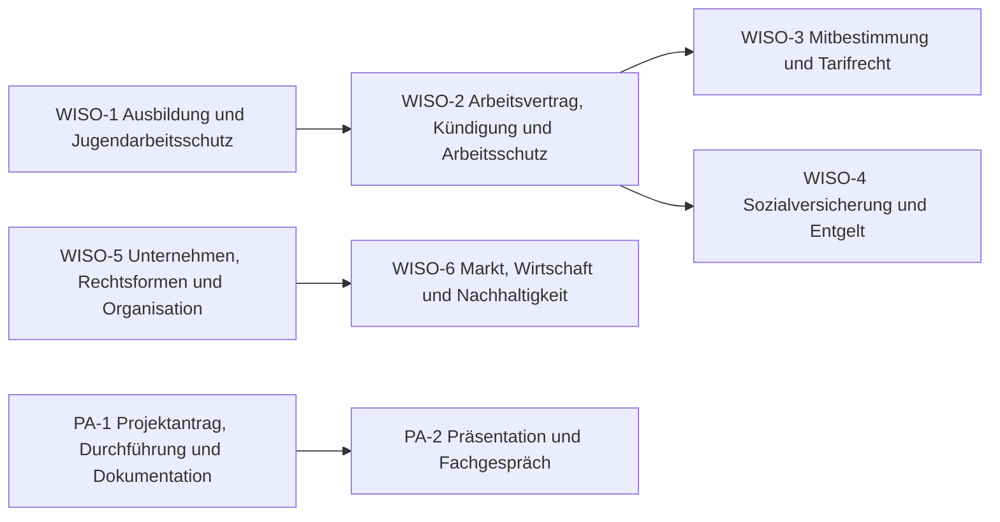

# Übersicht WiSo und Projektarbeit

Die Teile der AP2, die für FISI und FIAE gleich sind: die schriftliche **Wirtschafts- und Sozialkunde** und die **betriebliche Projektarbeit** mit Präsentation und Fachgespräch.

> [!info] Prüfung
> **Wirtschafts- und Sozialkunde** – 60 Minuten, 30 gebundene Aufgaben (ankreuzen, zuordnen, kurze Rechnungen), 10 % der Gesamtnote. **Projektarbeit** – 40 h (FISI) bzw. 80 h (FIAE), Dokumentation, 15 min Präsentation und 15 min Fachgespräch, 50 % der Gesamtnote. Simulation: [[WiSo-Quiz]]

## Lernpfad

*Pfeile: empfohlene Reihenfolge – was links steht, hilft beim Verständnis rechts. Die Knoten sind anklickbar.*

## Module
| | Modul | Inhalt |
|---|---|---|
| [[WISO-1 Ausbildung und Jugendarbeitsschutz\|WISO-1]] | Ausbildung und Jugendarbeitsschutz | duales System, Ausbildungsvertrag, Probezeit, Kündigung, JArbSchG, Urlaub |
| [[WISO-2 Arbeitsvertrag, Kündigung und Arbeitsschutz\|WISO-2]] | Arbeitsvertrag, Kündigung und Arbeitsschutz | Arbeitsvertrag, Befristung, Kündigungsarten und -fristen, KSchG, Arbeitsschutz, Sicherheitszeichen, Brandfall |
| [[WISO-3 Mitbestimmung und Tarifrecht\|WISO-3]] | Mitbestimmung und Tarifrecht | Betriebsrat, Beteiligungsrechte, Betriebsvereinbarung, JAV, Tarifvertrag, Tarifrunde |
| [[WISO-4 Sozialversicherung und Entgelt\|WISO-4]] | Sozialversicherung und Entgelt | fünf Zweige der Sozialversicherung, Beiträge, Generationenvertrag, Gehaltsabrechnung |
| [[WISO-5 Unternehmen, Rechtsformen und Organisation\|WISO-5]] | Unternehmen, Rechtsformen und Organisation | Kaufmann, Handelsregister, Rechtsformen, Gewinnverteilung, Prokura, Organigramme, Unternehmensziele |
| [[WISO-6 Markt, Wirtschaft und Nachhaltigkeit\|WISO-6]] | Markt, Wirtschaft und Nachhaltigkeit | Marktformen, vollkommener Markt, Konjunktur, magisches Viereck, Nachhaltigkeit, Umweltzeichen |
| [[PA-1 Projektantrag, Durchführung und Dokumentation\|PA-1]] | Projektantrag, Durchführung und Dokumentation | Rahmen FISI/FIAE, Antrag, Zeitplanung, Entscheidungen, Wirtschaftlichkeit, Bericht und Bewertung |
| [[PA-2 Präsentation und Fachgespräch\|PA-2]] | Präsentation und Fachgespräch | Präsentation aufbauen, Fachgespräch, Bestehensregeln, Ergänzungsprüfung, Notenschlüssel |

## Üben
- **Aufgaben:** [[Aufgaben WiSo]] · [[Aufgaben Projektarbeit]]
- **WiSo-Prüfungssimulation (30 Fragen, 60 min):** [[WiSo-Quiz]]
- **Karteikarten:** [[Karten WiSo]] · [[Karten Projektarbeit]]
- **WiSo-Probeprüfungen:** [[WiSo Probeprüfung 1]] · [[WiSo Probeprüfung 2]] · [[WiSo Probeprüfung 3]] · [[WiSo Probeprüfung 4]]

← [[AP2 Start]]

